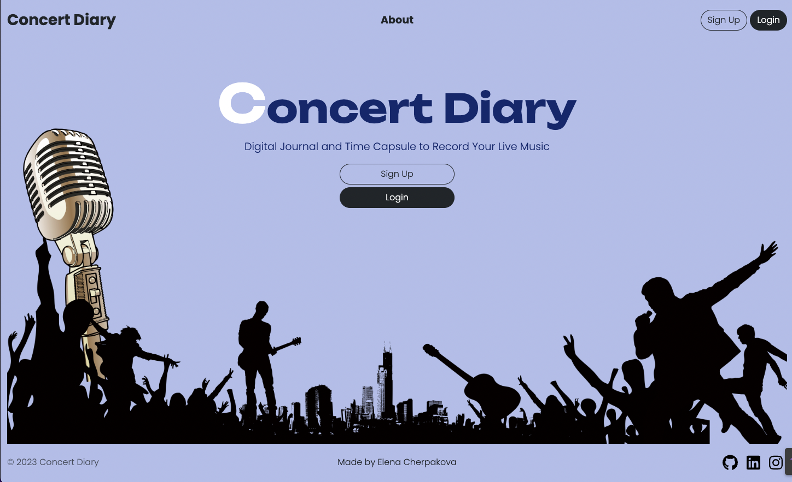
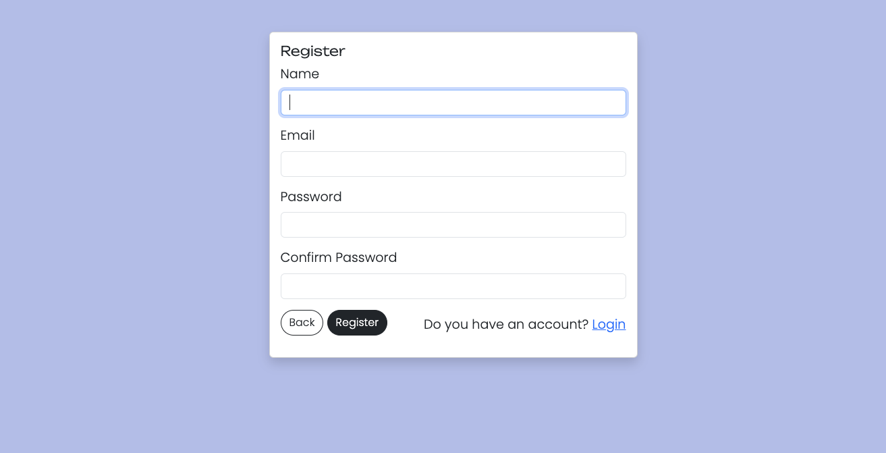
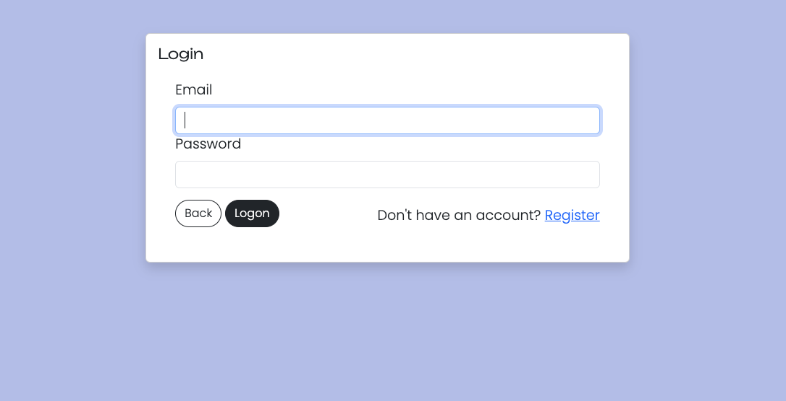
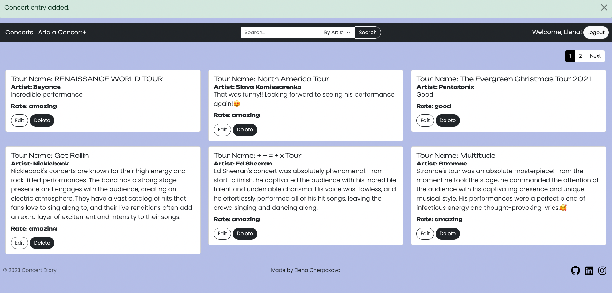
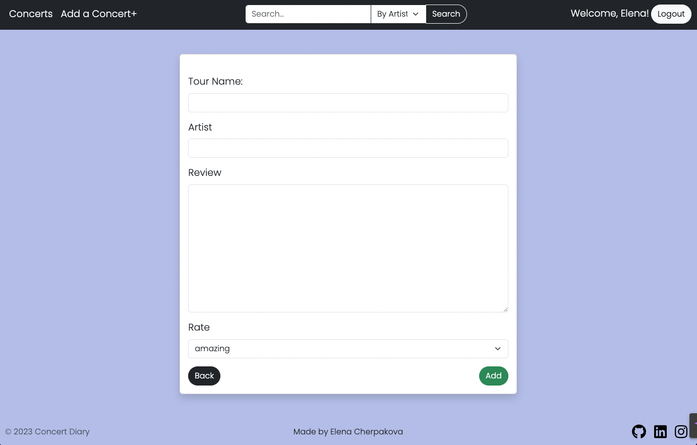

# Concert Diary 🎵

Concert Diary is a full-stack web application built with Node.js, Express, MongoDB, and EJS. It enables users to efficiently track, add, update, and delete their attended concerts, providing a seamless experience for concert enthusiasts. The application empowers users to maintain a personalized diary of their concert experiences, making it easy to manage and organize their concert records. With features such as user registration, authentication, search, filter, pagination, and secure server-side validation, Concert Diary ensures a robust and user-friendly platform for concert enthusiasts to keep track of their favorite events.

## Features ✨

- 📝 **User Registration and Authentication**: Users can create accounts, log in securely, and access their personal concert records.
- ➕ **Adding Concerts**: Users can add new concerts to their diary, providing details such as artist, venue, and date.
- ✏️ **Editing Concerts**: Users can edit the details of existing concerts in their diary, such as updating the artist, venue, or date.
- 🗑️ **Deleting Concerts**: Users can remove concerts from their diary when they are no longer relevant.
- 🔍 **Search and Filter**: Users can search for specific concerts and apply filters based on artist, venue, or date.
- 📄 **Pagination**: The application implements pagination for displaying concerts, allowing users to navigate through large sets of data easily.

## Tech Stack 🛠️

The Concert Diary project utilizes the following technologies:

- Node.js
- Express
- MongoDB
- EJS (Embedded JavaScript)
- Bootstrap

## Installation 🚀

To run the Concert Diary application locally, follow these steps:

1. Clone the repository: `git clone [repository-url]`
2. Install the dependencies: `npm install`
3. Set up the MongoDB database.
4. Update the database connection settings in the `.env` file.
5. Start the application: `npm start`

---
Front Page

Registration and Login

Dashboard

Add Concert Form

## Contributing 🤝

Contributions to the Concert Diary project are welcome! If you find any issues or have suggestions for improvements, please feel free to submit a pull request or open an issue.

## License 📄

The Concert Diary project is released under the [MIT License](LICENSE).
